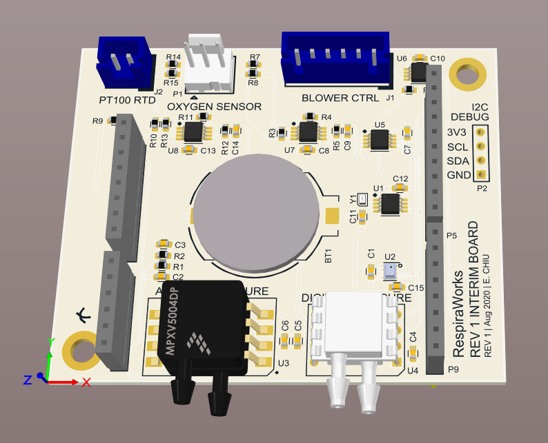

# Ventilator Rev1 Interim Daughtercard

This peripheral board is a development tool designed to provide many of the key features of the Rev A PCB to the current Rev 1.0 PCB

It can stack on top of the stepper drivers in the current Rev 1.0 PCB

Pin definitions, i2c addresses, part datasheets, and scalings are in the [Interface Control Document in GDrive](https://docs.google.com/spreadsheets/d/1JOSQKxkQxXJ6MCMDI9PwUQ6kiuGdujR4D6EJN9u2LWg/edit?usp=sharing)

## The objectives are:
- Allow us to de-risk new circuits and components for the Rev A PCB.
- Allow software devs to code for the new peripherals without waiting for the Rev A PCB.
- Allow us to demo more features in the Current Enclosed Build.
- Take some pressure off the Rev A PCB and give us more time to get it right.

## What's on this board:
- i2c RTC with backup battery
- Higher pressure sensors to allow us to control above 60cmH2O, both a 14b digital and analog option are provided.
- ^ this also frees up the former patient pressure sensor to be used for a 3rd venturi flow meter for oxygen flow sensing.
- 32kbit nonvolatile EEPROM
- Ambient (absolute) pressure sensor for altitude and temperature corrections
- Amplifier for the FiO2 oxygen sensor
- Level-shifted blower control, fixes the blower-full-speed-at-power-up issue: [Issue 740 on Ventilator](https://github.com/RespiraWorks/Ventilator/issues/740).
- Circuit for reading a PT100 RTD temperature sensor, for use such as reading motor or battery temperature.
